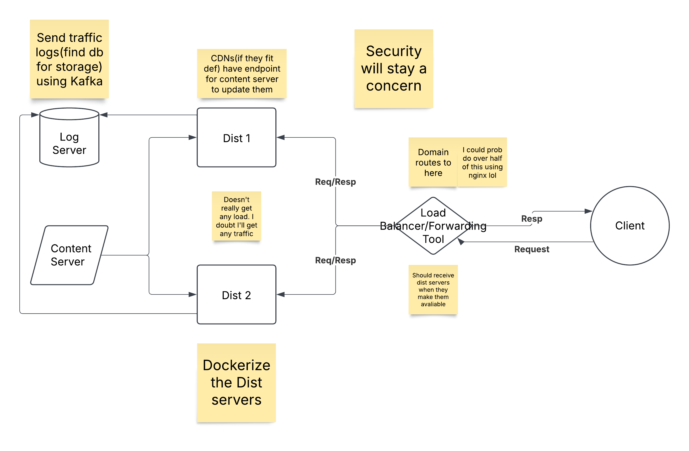

# BD
Background: I a conversation with a recruiter who said I didn't have a lot of backend experience. He is right so I wanted to get some practice.

Not sure what this is going to be right now. I'm thinking about turning it into a blog site.

My degree focuses on security and networking and much of my experience at my job revolves around system setup and using ML tools. It's hard to find a junior position where they all integrate together.

Also Pitt doesn't have a lot of web dev classes besides 1520 and Cloud Computing so I need to get practice with backend development on my own.

Kind of liking how this is turning out so far

