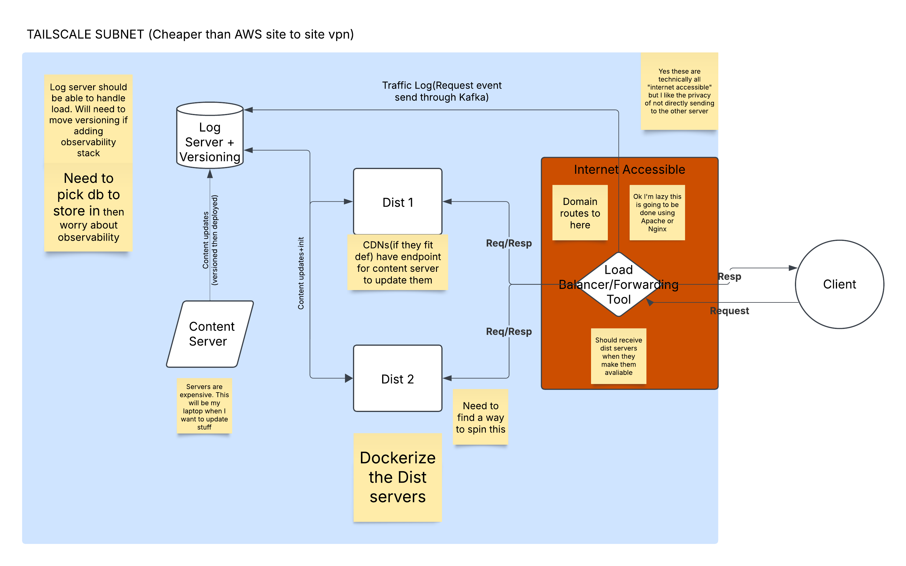

# Overengineered Static File Server

## Background / Blog: 

I wanted to develop and backend experience so I decided to develop and deploy this stack. 

Not sure what this is going to be right now. I'm thinking about turning it into a blog site.

My degree focuses on security and networking and much of my experience at my job revolves around system setup and using ML tools. It's hard to find a junior position where they all integrate together.

I'm also not sure where what I'm doing fits between backend and DevOps but CI/CD sounds like a greater version of what I'm doing. That being said, now that I'm coming back to those infinity diagrams knowing what all the software does it makes more sense.

Kind of miss writing spaghetti code in ROSpy

## Planned Systems

All systems are connected via Tailscale

**Load Balancer/Proxy:** EC2 instance(prob just a T2) using Nginx, Filebeat, Kafka. I should dockerize this but I might do that last because I can't have more than one endpoint if I only have one site.

**Event Log + Versioning Server:** Rasp Pi I have under my desk. Need to setup **ROAD** (roll over and die) protocol so my pie won't melt if this website gets reasonable traffic. Going to use mySQL for the log server with a Kafka inputter. Zookeeper will most likely be here as well. Versioning code is (poorly) written but it's here until I decide to use Kubernetes.

**Dist 1:** I didn't actually think about this one lol. I think it'll just go on another T2. 

**Content Server:** This is my laptop. I'm going to update new content from my laptop to the versioning server. Simple enough.

**Dist 2:** A scenario where I actually need to spin a second server isn't likely. There's also no point in sitting a computer on idle forever so I'll probably have to attach this to an auto-scaling AWS group which comes with another issue: where I don't want any control to be done by the exposed point(my proxy) and I want to rely on cloud controls as little as possible so I'm avoiding Elastic Load Balancer. I might try running Kubernetes on the observability stack and occasionally attaching this as a pod.

**Observability:** If I don't give up on this project by the time I get here I might hook an old computer I picked up from Pitt's free pile(I had to buy its own cpu cooler and ddr3 ram sticks to have all the parts, only cost me $20 + all the spare parts I've collected). Either way maybe I'll try Grafana with it.
